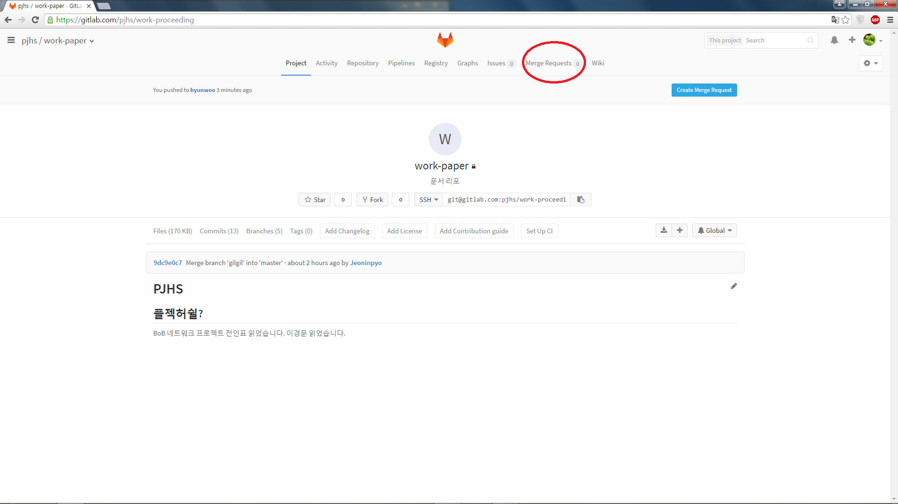
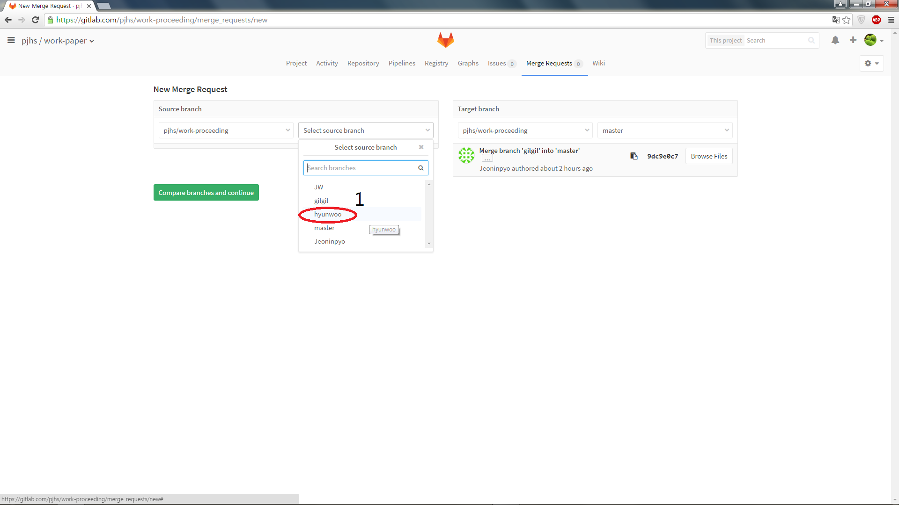
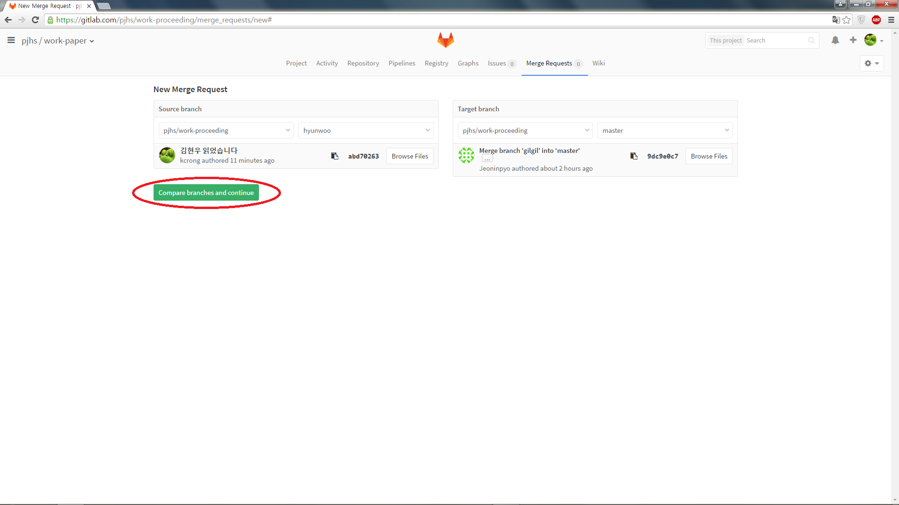
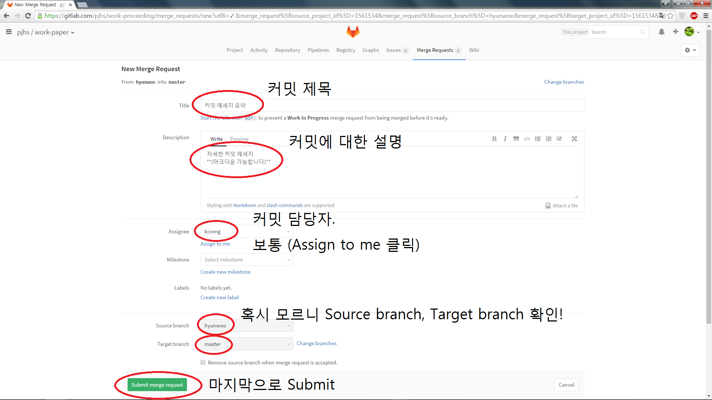
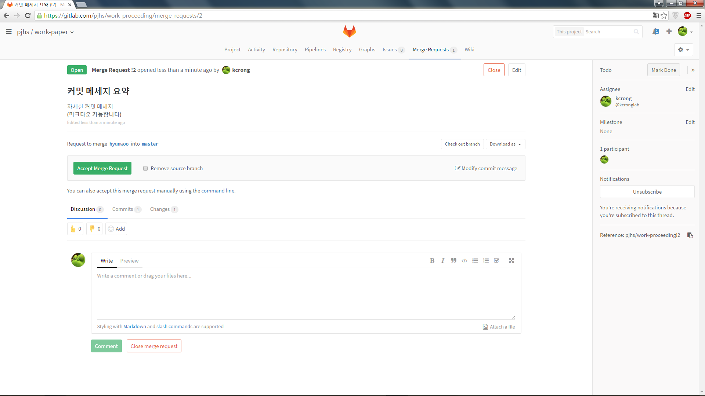

# GitLab 에서 Merge Request 생성하기 
**Write By Hyunwoo Kim**

## 전제조건
- 별도의 Branch 가 master 보다 앞선 커밋을 가지고 있을 경우

## 방법
### 1. Project 메인에 접속합니다.
### 2. Merge Requests 를 누릅니다

### 3. New Merge Request 를 누릅니다.

### 4. 병합하고 싶은 자신의 브랜치를 선택합니다

### 5. `Compare branches and continue` 버튼을 누릅니다.

### 6. Merge Request에 대한 자세한 설명을 적습니다.

### 7. 완성.

여기까지 한 후에, 각 담당    

각종 문서: **전인표**  
라즈베리파이: **조동민**  
서버개발: **김현우**  

위 분들이 각 Merge Request 검토해주시고 Master 브랜치에 Merge 해주시면 됩니다.  
